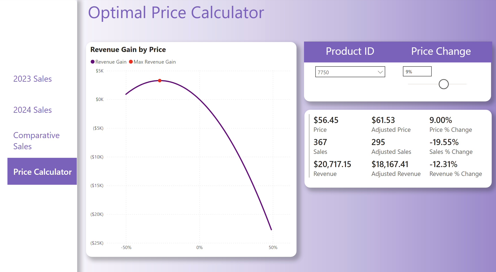

# price-optimizer
A project that leverages price elasticities and time series forecasting to generate revenue-maximizing prices for unique products. Utilizes Power BI to apply these findings in an actionable way. 

## Topics in Projects
### 1. Application of Price Elasticities
- Utilizes the log-log method by taking the natural logarithm of price and quantity, allowing linear regression to yield a direct measure of elasticity via the slope coefficient.
- Iteratively calculates the price elasticity for hundreds of products within the dataset.
- Only utilizes elasticities with a significant p-value, as elasticities are calculated through regression. 
### 2. LSTM Model
- Leveraged LSTM networks to capture complex temporal dependencies in travel sales data, effectively modeling trends, seasonality, and irregular fluctuations.
- Enabled accurate forecasting of future demand, which is critical for informing dynamic pricing strategies and inventory management.
- Employed Optuna to tune key hyperparameters (learning rate, dropout rate, number of LSTM layers, hidden layer size, and batch size) separately for each product.
- Integrated the optimized forecasts with price elasticity analysis to drive revenue-maximizing pricing recommendations.
### 3. Revenue Maximizing Function
- Employs a grid search that iterates through a range of potential price adjustments to evaluate their impact on revenue.
- For each candidate price change, it computes the adjusted price and the corresponding quantity (adjusted based on the estimated price elasticity), then calculates the resulting revenue.
- Identifies and selects the price change that produces the highest revenue, thereby optimizing the pricing strategy for maximum financial gain.
